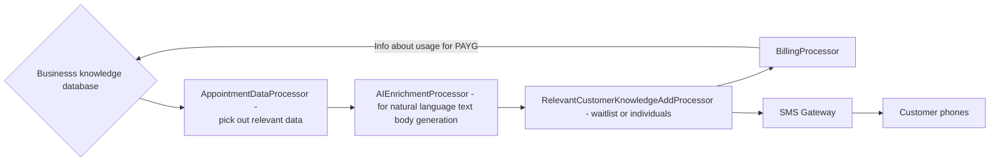

# Snatch MVP: Technical Planning and Guidelines

## Introduction

Welcome to the MVP Planning and Guidelines document for Snatch. This document is designed to provide a comprehensive overview of our vision and strategic approach for developing the first iteration of our product.

The purpose of this MVP is to validate our core product idea and gather essential feedback from users. By focusing on the most critical features, we can deliver a functional and valuable product to our users very quickly and efficiently.

This document serves as a roadmap to guide the development process and ensure that we remain aligned with our users' needs, and to set the foundation for future growth.

## MVP Vision and Goals

### Vision

Our vision for the MVP is to create an efficient, automated appointment availability notification service that meets the immediate needs of businesses which run appointment-based services. By providing a seamless and reliable notification solution, we aim to enhance the client experience, improve operational efficiency (free up time for the providers) and also generate revenue growth by minimizing number of appointments which go unbooked.

### Goals

1. **Find Product-Market Fit**: To do so, we aim to find answers to questions including the following. Which vertical(s)/industries do we want to hone in on? Which specific features are going to be MOST valuable to and used by our customers in practise?
2. **User Engagement and Product Traction**: Build a landing page detailing what the product is and why we are building it, include a 'add your email for updates' form as a measure of interest/traction. Build up network of users to try out the MVP. Have users engage with the MVP.
3. **Gather Feedback**: Collect actionable feedback from early adopters of the MVP to refine and improve the product based on real-world use cases. In the case of a lot of unstructured feedback, we may create a feedback pipeline or form to help us understand user experience better.
4. **Determine venture-scalability**: Which areas of the are venture-scale, and which are not? If and when we take funding from VCs, how much do we need to stay as lean and as in control as possible?
5. **Build a Foundation for Growth**: Establish a robust, scalable technology architecture that can support additional features and enhancements in the future.

## Essential Features and Scope

### Scope

The experience that we are providing for our customers in the MVP:

1. Multi-threaded SMS-based waitlist subscription and alerting.
2. Appointment confirmation capability in the SMS
3. Appointment change/cancellation IN TEXT.
4. Personalized text blasts (stretch)
5. User can text business (e.g text "FIND") and get returned all the open slots they may have. Don't have to call ahead or check the website

### MVP Features

1. **Calendar Integration**:

   - Business can integrate with their appointment calendar(s) to seamlessly feed Snatch with open appointment information.
   - Ensure this works for all the common types of calendar integrations (e.g ical links, API)
   - Produce very easy to follow guide for how to integrate EVERY type of calendar

2. **User-Friendly Interface**:
   - Mobile-friendly web app (site)
   - Doesn't have to be pretty.
3. **Integrated with SMS and Email Gateway**:

   - Businesses can can send texts and emails to their clients.
   - Messaging is two-way. Clients can respond.

4. **Natural language context-enriched messaging**:

   - Context is absorbed (e.g information about appointment availability)
   - Offer API access for custom integrations as needed.

5. **Payment for subscription/PAYG processing**

   - This is VITAL because they pay = they like it
   - This is scary because they don't want to pay = they don't see the value or we need to do a better job of convincing them that their opportunity cost of not using it is very high
   - Need to set up telemtry for US to see how many texts are sent and to bill accordingly
   - Auto subscription management for the businesses.

### Architecture diagram v0.1

This is what I (Aliya) am visualizing at a very basic level in my mind of the data flow.

## User Insights and Research

Some strong tailwinds which hypothetically validate our thesis (although, of course, nothing is more validating than getting credit card information).

1. 80% of businesses are using SMS marketing software to text their customers (we are not marketing software, but this is a strong indicator that they are open to SMS communication with their clients)
2. SMS has a 98% open rate and 36% averge click through rate. For reference, email has 3.4% CTR.
3. No-show rates in healthcare [can be as high as 80%](https://www.ncbi.nlm.nih.gov/pmc/articles/PMC7280239/) and cost the overall system approx [$150B annually](https://kyruushealth.com/the-importance-of-negating-patient-no-shows/) ($150,000 per solo physician per year).
4. Appointment attendance doubles for those getting reminders vs those who do not. [Source](https://www.sciencedirect.com/science/article/pii/S165836121300084X)

5. 30% of appointments are canceled at hair, beauty and wellness salons, about $67,000/year revenue loss.
6. 66% of consumers say they would pay more for something supported by a P2P texting solution [source](https://callhub.io/blog/text-messaging/text-message-statistics/)
7. 65% of people wurlwide use SMS to engage with companies (Salesforce, 2023). Email at 93%
8. AI driven personalization and omnichannel commerce (e.g SMS affiliates) are the top business trends for 2024 (Bolt, 2023). Again not strictly our product but adjacent. Phones are very much in the hands of customers and we should build something that meets them where they are.
9. 43 out of 56 studies on SMS appointment reminder effectiveness found that SMS reminders either increase rate of attendance, increate rate of timely cancellations (allowing someone else to be found to get the slot) or decrese rate of missed appointments [Source](https://www.ncbi.nlm.nih.gov/pmc/articles/PMC6112101/)
10. Country club membership is increasing every year and more clubs are looking to modern technology solutions for their scheduling [Source](http://www.uncorkd.biz/wp-content/uploads/2016/03/A-Guide-to-Integrating-Technology-Solutions-for-Country-Clubs.pdf)

## Objectives and Success Metrics

1. Onboard 100 PAYING customers in 2 months.
2. Have 60%< of those customers roll over their subscription or PAYG to the next month.

## Timeline and Milestones

I (Aliya) am generally a hater of planning just because. It is productive procrastination and uses up energy and resources that you could instead be using to build something tangible very quickly. Also complex planning at the beginning is basically redundant as goals and pivots can shake this up. Therefore, in lieu of a concrete timeline, here are some very attainable goals that we should try to reach. Also, it allows us to figure out our actualy work velocity.

0. Pick a day to "start".
1. Build something **shippable** in 30-45 days from day of start.
2. Sign up 500 businesses on an interest list.

## Resources and Budget

We will lay this out more later but for MVP:

1. Bootstrapped
2. If you buy or free trial anything (i.e server credits) save the receipt so we can business expense it later.
3. Try to use free or hobby tier versions of software or components (great way to test what works best for us).

## Collaboration and Communication Plan

Keep it simple

1. Text frequently
2. async updates on the day's progress
3. generous phone calling
4. Keep a "task board" in a document in the repo (or in google drive, tbd), e.g in technical_super_list.md
5. No trello boards, NO OVERHEAD
6. build very fast. if something looks/feels right to do. go for it. build it and deploy it, we can figure it out later. that is what version control is for.
